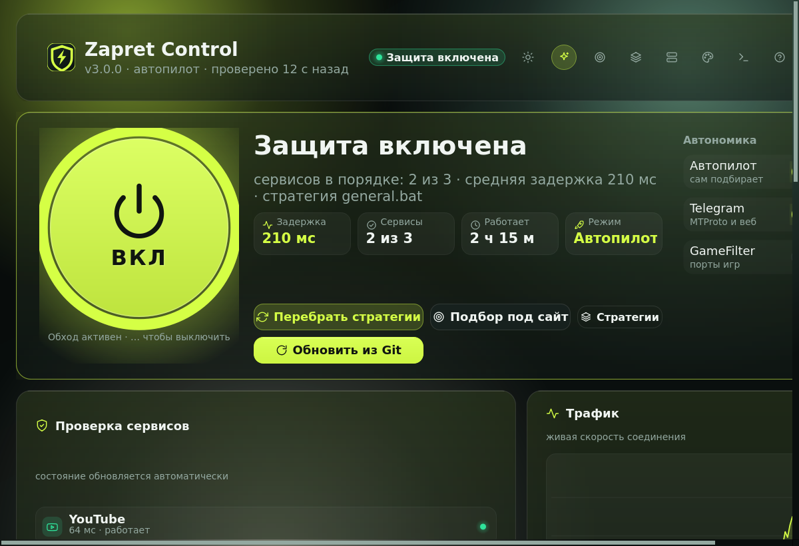
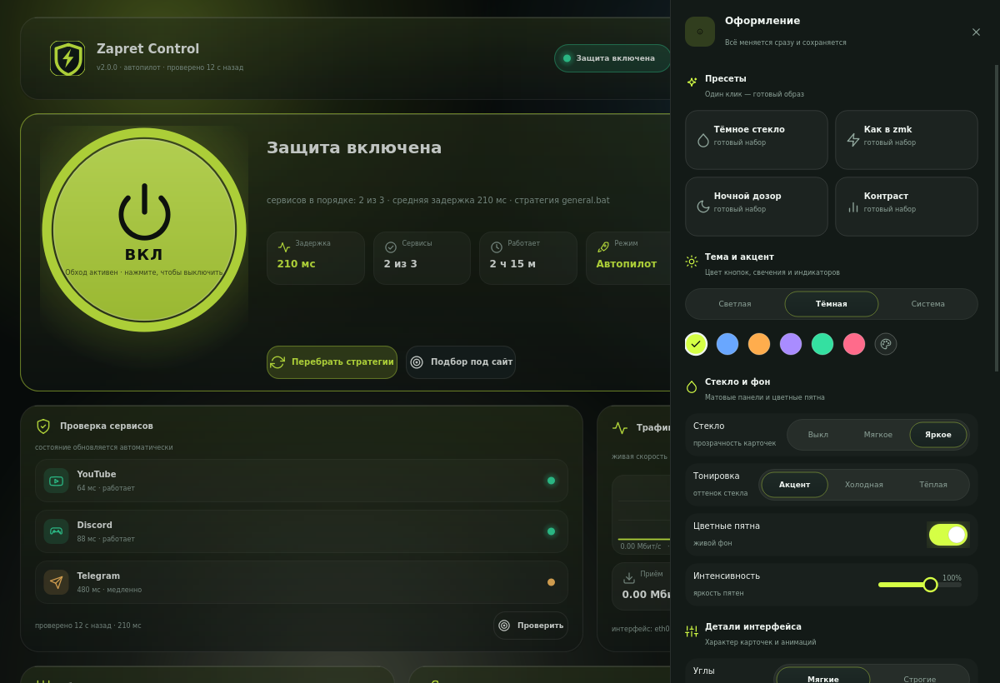
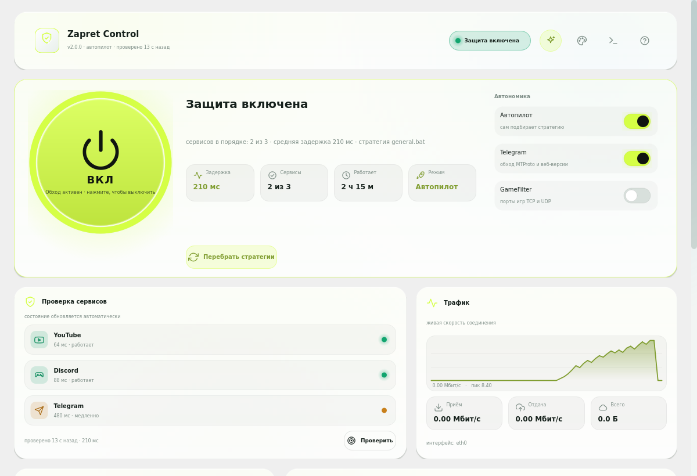
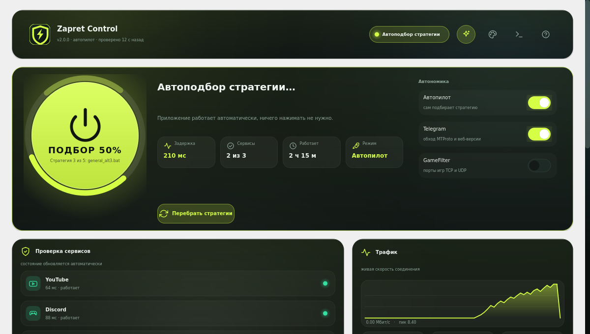
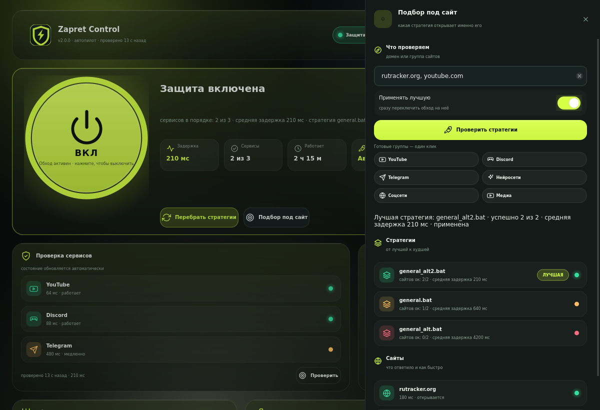
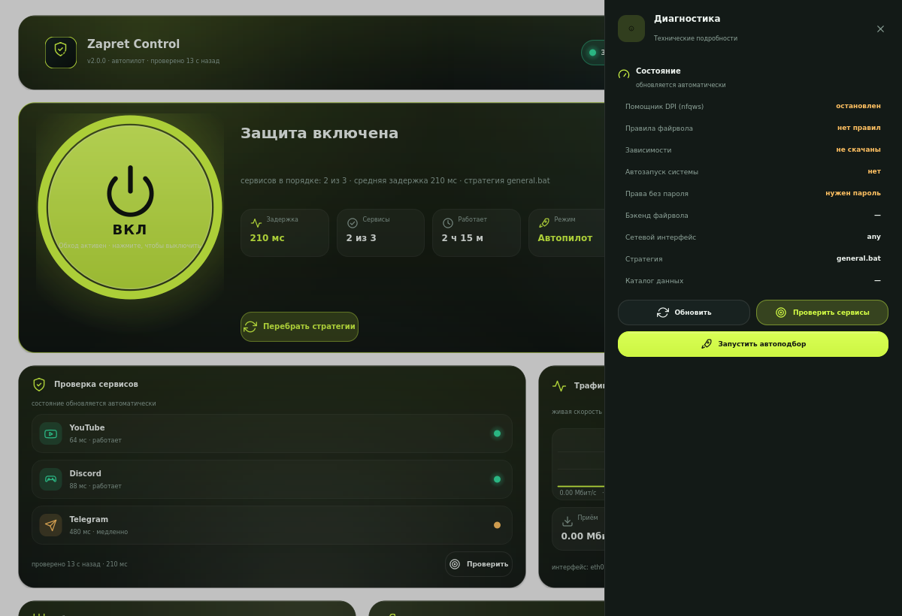

<div align="center">

# 🛡️ Zapret Control 2.2.1

**Linux-приложение для обхода DPI-замедлений и блокировок — без VPN и подписок.**
Работает на уровне пакетов (`nfqws` + `nftables`/`iptables`): YouTube, Discord,
Telegram и другие сервисы открываются напрямую, без чужих серверов и потери скорости.

**Одна большая кнопка — всё остальное само:** автоподбор рабочей стратегии,
автовключение при старте, автовосстановление при падении, проверка сервисов
и обновления в один клик. Работает на **X11 и Wayland** (Ubuntu 26.04, Debian,
Arch, Fedora — платформа Qt подбирается автоматически), интерфейс на **Qt6**:
тёмное и светлое стекло, кастомизация, системный трей.

</div>

---

## 📸 Как выглядит

| Главный экран | Оформление |
| --- | --- |
|  |  |

| Светлая тема | Автоподбор стратегии |
| --- | --- |
|  |  |

| Подбор под конкретный сайт | Тёмная тема целиком |
| --- | --- |
|  |  |

Тёмная и светлая темы переключаются одной кнопкой **☀ / ☾** в шапке и действуют
на всё окно: палитра приложения (поля ввода, подсказки, меню, полосы прокрутки)
перекрашивается вместе с интерфейсом, светлых «заплаток» не остаётся.

---

## ⚡ Если что-то не работает — сначала это

```bash
python3 run.py doctor      # что не так
python3 run.py repair      # чинит это одной командой
```

`doctor` проверяет всё по очереди (Python, Qt и плагин `xcb`, nfqws, стратегии,
файрвол, права, службу, ярлык, трей, есть ли дисплей и чья это сессия) и **пишет
готовую команду установки** для вашего дистрибутива. Девять из десяти «кнопка не
работает» лечатся этим выводом.

`repair` делает то, что следует из вывода `doctor`, автоматически: возвращает
файлы настоящего владельца, пересоздаёт ярлык в меню приложений и значок на
рабочем столе, правит `sudoers` и поднимает окно. Если приложение установили
через `sudo -i`, починка переносит его из `/root` в ваш домашний каталог:
`sudo python3 ~/.local/share/zapret-control/run.py repair`.

---

## 🚀 Установка, запуск и обновление — одной командой

```bash
curl -fsSL https://raw.githubusercontent.com/danilka-revin/Zapret/main/install.sh -o /tmp/zc-install.sh && bash /tmp/zc-install.sh
```

`sudo` для установки **не нужен**. Команда сама:

1. поставит системные библиотеки для Qt6 (`libgl1`, `libegl1`, `libxkbcommon0` и т. д.);
2. поставит интерфейсный модуль **PySide6-Essentials**;
3. скачает приложение;
4. скачает зависимости — **nfqws** и актуальные стратегии Flowseal;
5. создаст ярлык в меню приложений **и значок на рабочем столе**;
6. пропишет `NOPASSWD` для `nft`/`nfqws` и запустит приложение — с окружением
   вашего графического сеанса, а не root-шелла.

Установщик определяет пользователя рабочего стола (`SUDO_USER`, активная сессия
`logind`, `/run/user/<uid>`, `who`), поэтому запуск через `sudo -i` больше не
означает «приложение в `/root`, окна нет, на столе пусто»: код, зависимости,
ярлык и права оформляются на живого пользователя, а старая «корневая» копия
переносится в его домашний каталог и удаляется.

Повторный запуск той же команды — это обновление: обновятся код и зависимости.
Другие режимы:

| Команда | Что делает |
| --- | --- |
| `bash install.sh` | установить/обновить, скачать зависимости, создать ярлык, запустить |
| `bash install.sh update` | обновить код и зависимости, перезапустить интерфейс |
| `bash install.sh gui` | только запустить интерфейс (с проверкой, что окно живое) |
| `bash install.sh repair` | починить установку: ярлык на столе, права, перенос из `/root` |
| `bash install.sh doctor` | диагностика: что мешает запуску |
| `bash install.sh uninstall` | удалить всё, включая службу, ярлык и `sudoers` |
| `--user ИМЯ` | установить для конкретного пользователя |
| `--no-launch`, `--no-deps` | не запускать интерфейс / не качать зависимости |

> Из локальной копии репозитория:
> ```bash
> git clone https://github.com/danilka-revin/Zapret && cd Zapret && ./install.sh
> ```

---

## 🎯 Философия: минимум настроек — максимум автономики

- **Одна большая кнопка.** Нажали — защита включилась, нажали ещё раз — выключилась.
  Больше ничего настраивать не нужно.
- **Автопилот.** При включении приложение само перебирает стратегии Flowseal, проверяет
  YouTube, Discord и Telegram и оставляет самую быструю рабочую. Ход подбора видно прямо
  на кнопке: «ПОДБОР 50%» и «Стратегия 3 из 5: general_alt3.bat». Если идеальный результат
  найден досрочно — перебор прекращается.
- **Проверка окружения при старте.** Приложение сразу говорит, чего не хватает
  (нет файрвола, нет прав, не скачаны зависимости), вместо сухого «Ошибка».
- **Автозапуск системы.** `systemd`-служба поднимает защиту при загрузке.
- **Автовосстановление.** Если обход упал сам, приложение поднимает его обратно.
  Если вы выключили его вручную — не трогает.
- **Проверка сервисов по расписанию** (30 с / 1 мин / 5 мин) с живыми задержками.
- **Старт в трее.** Автозапуск не мешает работе — окно открывается по клику на иконку.
- **Окно подстраивается под экран.** На ноутбуке 1366×768 ничего не обрезается.
- **Понятные ошибки.** Вместо «Ошибка» — «Не установлен файрвол: sudo apt install nftables».
- **Обновление одной кнопкой.** «Обновить и перезапустить» в карточке
  «Обслуживание» тянет код (git или архив), свежие nfqws и стратегии, пересоздаёт
  ярлык, проверяет права — и перезапускает себя, не выключая обход. Приложение
  само подсказывает, что вышла новая версия.

---

## ✨ Что умеет

### Экран
- Большая кнопка включения с прогрессом, пульсацией и свечением.
- Живая проверка YouTube, Discord, Telegram: задержка, статус, повторный запуск.
- График скорости, приём/отдача и суммарный трафик по сетевому интерфейсу.
- Журнал всех операций с фильтрами, копированием и выгрузкой.

### Кастомизация (панель «Оформление»)
- Тема: **светлая / тёмная / системная**.
- Акцент: 6 пресетов + любой цвет через системный выбор цвета.
- Стекло: выкл / мягкое / яркое; тонировка стекла: акцентная / холодная / тёплая.
- Цветные «пятна» на фоне с ползунком интенсивности.
- Углы: мягкие или строгие. Плотность: комфортная или компактная.
- Анимации: полные / мягкие / выключены. Размер текста: малый / обычный / крупный.
- 4 готовых пресета в один клик. Всё сохраняется в `config.json`.

### Автономность
- Автопилот подбора стратегии (в том числе кнопкой «Перебрать стратегии»).
- Подбор под группу сайтов и пресеты «домены + стратегия»: сохранил один раз —
  дальше применяешь одним нажатием.
- Автозапуск системы, автовосстановление, трей, уведомления, период проверок.

### 🎯 Подбор под конкретный сайт и группу сайтов
Бывает, что YouTube летает, а один сайт не открывается — или наоборот, виснет
целый сервис. Тогда нужен не общий перебор, а стратегия под конкретные домены:
кнопка **«Подбор под сайт»** (или `Ctrl+T`).

- вводите домен (`rutracker.org`, ссылку, несколько сайтов через запятую);
- или отмечаете **готовые группы**: YouTube, Discord, Telegram, Нейросети,
  Instagram, TikTok, Twitter / X, Twitch, WhatsApp, Музыка, Кино, Google,
  Соцсети, Игры, Торренты, Облака — отмечать можно **сразу несколько**, и
  стратегия подберётся под все выбранные сервисы одной проверкой;
- приложение само проверяет эти сайты на каждой стратегии и выбирает лучшую
  по скорости и числу открывшихся сайтов;
- переключатель **«Применять лучшую»** включён — обход сразу переключится на
  найденную стратегию; выключите его, если хотите только посмотреть результат;
- внизу — таблица «какая стратегия сколько сайтов открыла» и построчный
  результат по каждому домену (миллисекунды, ответ, медленный TLS).

**Своя группа.** Набрали в поле список сайтов, ввели название («Работа») и
нажали «Сохранить группу» — получили собственный чип с этими доменами. Он
подписывается в конфиг, участвует в мультивыборе, удаляется кнопкой-корзиной.

**Пресеты.** Найденную стратегию можно сохранить под своим именем: подберите
стратегию под «YouTube + Discord», введите имя пресета и нажмите
«Сохранить пресет». Дальше карточка пресета живёт на панели и умеет:

- **Применить** — поставить эту стратегию сразу (обход перезапустится сам);
- **Проверить** — перепроверить пресет именно его стратегией: если она всё ещё
  работает, перебор заканчивается на первом шаге, а результат в пресете
  обновляется;
- **Удалить** — убрать пресет.

Если снова запустить подбор для тех же доменов, приложение не начнёт с нуля, а
сначала проверит сохранённую стратегию — это экономит минуты перебора.

То же самое из командной строки:

```bash
python3 run.py autopilot --sites "rutracker.org, youtube.com"   # только измерить
python3 run.py autopilot --sites rutracker.org --apply          # и применить лучшую
python3 run.py autopilot --groups youtube,discord --apply       # стратегия под группы
python3 run.py autopilot --preset "Видео и чат"                 # перепроверить пресет
python3 run.py autopilot --groups telegram --save-preset "Телега"
```

### Обход Telegram
Отдельные правила для `MTProto` (TCP 443), веб-версии и звонков (UDP):
домены — `extras/list-telegram.txt`, сети Telegram — `extras/ipset-telegram.txt`,
стратегия — `extras/telegram.bat`. Переключатель **Telegram** на главном экране.

---

## ⌨️ Горячие клавиши

| Клавиши | Действие |
| --- | --- |
| `Ctrl+P` | Включить/выключить защиту |
| `Ctrl+R` | Проверить сервисы |
| `Ctrl+T` | Подбор стратегии под сайт или группу сайтов |
| `Ctrl+,` | Оформление и автономика |
| `Ctrl+L` | Журнал |
| `Ctrl+D` | Диагностика |
| `Esc` | Закрыть панель |
| `Ctrl+Q` | Выход |

---

## 📋 Командная строка

```bash
python3 run.py gui                      # графический интерфейс (Qt6)
python3 run.py start | stop | restart   # запуск/остановка обхода
python3 run.py status                   # статус в JSON
python3 run.py ensure-deps              # скачать nfqws и стратегии
python3 run.py launch                   # запустить интерфейс и проверить, что окно живое
python3 run.py shortcut install|remove|status  # ярлык (меню + рабочий стол)
python3 run.py service install|remove|start|stop  # systemd-служба
python3 run.py permissions install|remove         # NOPASSWD для nft/nfqws
python3 run.py check-update             # есть ли новая версия (git или GitHub API)
python3 run.py update [--restart]       # код + зависимости + ярлык + права, затем перезапуск
python3 run.py repair                   # починить установку: /root → пользователь, ярлык, права
python3 run.py doctor                   # самодиагностика: что мешает работать
```

---

## 🧪 Разработка и проверки

```bash
python3 -m pytest tests -q                    # 116 модульных тестов: ядро, тема, пресеты, подбор,
                                              # ярлыки, сессия, обновление, починка
QT_QPA_PLATFORM=offscreen python3 tools/smoke_test.py   # 83 проверки: клики по всем кнопкам,
                                              # панели, колесо и тачпад, горячие клавиши
python3 tools/screenshot.py --out /tmp/shots  # скриншоты без графического сервера
```

`tools/smoke_test.py` подменяет системные вызовы заглушками, нажимает каждую кнопку
и переключатель и проверяет, что состояние действительно меняется: включение обхода,
автопилот, подбор под сайт, панели, кастомизация, переключение темы, горячие
клавиши. Именно такой тест ловит ситуацию «кнопка не работает».

---

## ⚙️ Требования

- Linux: X11 и Wayland (проверено на Ubuntu 26.04/Debian, работает на Arch, Fedora и др.)
- `python3` (3.9+) и `python3-pip`
- **PySide6-Essentials** (ставится автоматически через pip)
- системные библиотеки Qt6: `libgl1`, `libegl1`, `libxkbcommon0`, `libdbus-1-3` (ставятся установщиком)
- для X11: пакеты `libxcb-*`; для Wayland: `libwayland-client0`, `libwayland-cursor0`, `libwayland-egl1`
  (тоже ставит установщик; если родная платформа Qt недоступна, приложение само
  переключается на запасную — на Wayland-сессии это `xcb` через XWayland)
- `nftables` или `iptables`, `curl`
- архитектуры `x86_64`, `aarch64`, `armv7l` и др. (nfqws подбирается автоматически)

<details>
<summary>Почему Qt, а не tkinter</summary>

Первая версия рисовала интерфейс на tkinter: он требовал `python3-tk`, хуже выглядел и
не тянул нормальные тени, стекло и анимации. Версия 2.0 полностью переписана на Qt6 —
современные виджеты, сглаживание, системный трей, нативные уведомления и один и тот же
код на всех дистрибутивах.

</details>

---

## 📦 Как устроено

```
zapret/                # Python-пакет
├── qt/                # интерфейс на Qt6
│   ├── app.py         # главное окно, трей, горячие клавиши
│   ├── controller.py  # состояние и все операции (в отдельных потоках)
│   ├── theme.py       # тема, акценты, пресеты, размеры
│   ├── widgets.py     # стеклянные карточки, кнопка питания, переключатели, график, тосты
│   ├── sheets.py      # панели: оформление, журнал, диагностика, справка
│   └── icons.py       # 70 векторных иконок + иконка приложения
├── autopilot.py       # автоподбор стратегии по реальным проверкам
├── checks.py          # проверки сервисов, задержки, трафик
├── core.py            # nfqws, стратегии, файрвол (nftables/iptables)
├── integration.py     # systemd-служба, ярлык (меню + рабочий стол), sudoers
├── session.py         # пользователь рабочего стола, DISPLAY/XAUTHORITY, запуск GUI
├── telegram.py        # данные для обхода Telegram
├── config.py          # конфигурация
├── repair.py          # починка установки: перенос из /root, права, ярлык, запуск
└── update.py          # самообновление: git/архив, зависимости, перезапуск
tools/                 # smoke_test.py, screenshot.py
tests/                 # модульные тесты
extras/                # telegram.bat + списки Telegram
assets/screenshots/    # скриншоты интерфейса
install.sh             # установка/запуск/обновление одной командой
run.py                 # точка входа
```

Данные приложения: `~/.local/share/zapret-control/` — `nfqws`, `deps/flowseal/` (стратегии),
`config.json` (в том числе секция `ui` с оформлением).

---

## 🔧 Если кнопка не работает

Порядок действий — сверху вниз, обычно хватает первого пункта.

1. **`python3 run.py doctor`** — покажет, чего не хватает, и даст точную команду
   установки для вашего дистрибутива.
2. **Окно вообще не открывается.** Не установлен PySide6 или библиотеки Qt:
   ```bash
   python3 -m pip install --user PySide6-Essentials
   # Debian/Ubuntu
   sudo apt install libgl1 libegl1 libxkbcommon0 libxcb-cursor0 libdbus-1-3
   ```
   Если в консоли `Could not load the Qt platform plugin "xcb"` — не хватает
   `libxcb-cursor0` и соседних пакетов; `run.py doctor` печатает полный список
   для вашей системы. Начиная с 2.2.1 приложение при старте само перебирает
   платформы Qt (`авто → xcb → wayland`) и берёт первую рабочую, так что руками
   `QT_QPA_PLATFORM` задавать обычно не нужно. Вручную: `QT_QPA_PLATFORM=wayland
   python3 run.py gui` (родной Wayland) или `QT_QPA_PLATFORM=xcb python3 run.py gui`
   (через XWayland).
3. **Кнопка нажимается, но защита не включается.** Почти всегда права: нажмите
   **«Настроить права (1 раз)»** в приложении (или `python3 run.py permissions install`) —
   это один раз спросит пароль sudo и пропишет NOPASSWD для `nft`, `iptables`, `nfqws`,
   `systemctl`.
4. **Нет файрвола.** `sudo apt install nftables` (Debian/Ubuntu),
   `sudo pacman -S nftables` (Arch), `sudo dnf install nftables` (Fedora).
5. **Не скачаны зависимости.** Кнопка «Обновить зависимости» или
   `python3 run.py ensure-deps`.
6. **Окно открылось, но ни одна кнопка не нажимается и не прокручивается.**
   Такое было в старых версиях: интерфейс перекрывался служебными слоями, которые
   забирали все события мыши. Обновитесь (`bash install.sh update` или «Обновить
   и перезапустить»): фон теперь прозрачен для мыши, затемнение панелей всегда
   прячется вместе с ними, а после показа окна приложение само пишет в журнал,
   если содержимое кем-то перекрыто. Проверить можно так:
   ```bash
   QT_QPA_PLATFORM=offscreen python3 tools/smoke_test.py | grep -A9 "Клик и колесо"
   ```
   Отдельный случай — **тачпад на Wayland**: он шлёт только пиксельные события
   колеса, которые Qt по умолчанию игнорирует. С версии 2.2.1 их обрабатывает
   приложение (плавная прокрутка 1:1, знак как у обычного колеса).
7. **Приложение установилось через `sudo`, окна нет и на столе пусто.** Всё
   (код, зависимости, ярлык, `sudoers`) осело в `/root`. Перезапустите установщик
   без `sudo` — он перенесёт установку на вашего пользователя, — или выполните:
   ```bash
   sudo python3 /root/.local/share/zapret-control/run.py repair
   ```
8. **Ярлык есть в меню, но нет значка на рабочем столе.** Кнопка
   **«Создать ярлык (меню + рабочий стол)»** в карточке «Обслуживание». GNOME требует
   разрешения на запуск: правый клик по значку → «Разрешить запуск»
   (установщик делает это сам через `gio set metadata::trusted true`).
   Если каталога «Рабочий стол» нет (чистый GNOME без расширения значков) —
   ярлык останется только в меню приложений.
9. **Всё равно не ясно.** Откройте «Диагностику» (видно состояние nfqws, правил,
   прав, бэкенда, интерфейса, ярлыка и обновлений) и «Журнал» — последняя строка
   обычно объясняет причину словами.

---

## 🙏 Благодарности и лицензия

Проект основан на:

- [zapret](https://github.com/bol-van/zapret) — bol-van (MIT);
- [zapret-discord-youtube](https://github.com/Flowseal/zapret-discord-youtube) — Flowseal (MIT);
- [zapret-discord-youtube-linux](https://github.com/Sergeydigl3/zapret-discord-youtube-linux) — Sergeydigl3.

Бинарник `nfqws` и стратегии скачиваются из официальных релизов/репозиториев напрямую
и подчиняются их лицензиям (MIT). Код приложения — см. `LICENSE` (MIT).

> ⚠️ Приложение предназначено для обхода искусственного замедления легитимных сервисов.
> Используйте только там, где это не запрещено законодательством вашей страны.
